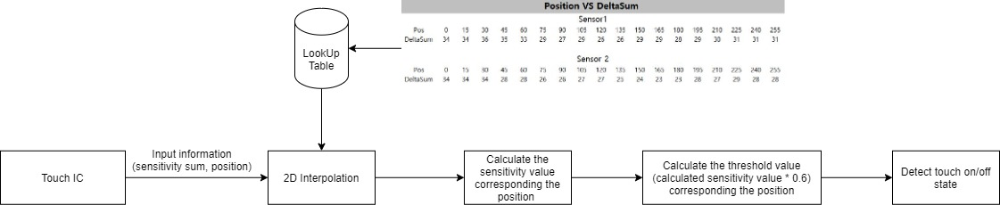
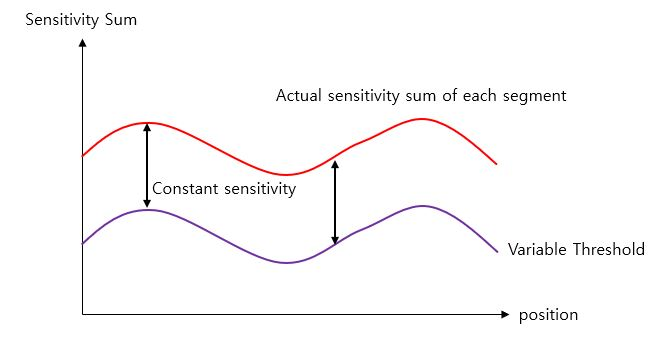
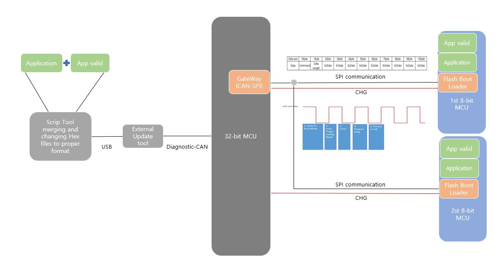

# IONIQ HEV/EV(AE PE/ AEEV PE)

## 1. Project Overview
- This project item is made of 2 parts: HVAC controller and 0D & 1D touch system
- I was in charge of the entire software development of the touch system and application

## 2. Development Environment
-  Software Platform developed internally(Non OS platform)
-  Compiler: Green Hills
-  V850 32-bit Microprocessor | ATtiny 1616 8-bit microprocessor 2ea
-  Git, Jira, Script Tool

## 3. Challenging issues / Research and Solution / Result
This section demonstrates what was challenging issues, how to research them, and how to solve them

---
### Challenge #1 - Ameliorating the non-linear sensitivity of slide touch sensors by devising software algorithms
When implementing a tap function by using slide touch sensors that are composed of interlaced patterned two nodes, irregular sensitivity was caused in the entire area of slide touch sensors, for the slide touch sensors were designed with a small size, erratic patterns in the connection, and the sensors were located under a concave cover panel. To ensure the constant sensitivity of slide touch sensors, I introduced a software algorithm, variable threshold using interpolation

### Research and Solution #1
**(Step 1)** Collected touch information such as positions, sensitivity values through SPI communication from touch microprocessor 
**(Step 2)** Made a two-dimensional lookup table with 30 elements that represents that X-axis presents a position value and the Y-axis demonstrates a sensitivity value corresponding to the X-axis position value 
**(Step 3)** Calculated a threshold value (80 % of max sensitivity value) corresponding to a new position value from the lookup table by using a two-dimensional interpolation 
**(Step 4)** Decided the slide touch’s on-off state from sensitivity values and the calculated threshold 

 
<strong>Fig.1) the design pattern of slide(wheel touch sensors</strong>

**Fig.1)** shows the pattern of slide (wheel) touch sensor. When implementing 'Tap' gesture function by utilizing the slider touch sensor, the sensitivity sum of each sensor segment will be used to detect finger's touch state. In order to implement 'Tap' gesture function, the entire slider touch sensor should have a property of constant sensitivity regardless of the position of 'Tap' gesture on the slider touch sensor like **Fig.2)**. If the slider touch sensor does not show this property, a user definitely will feel the irregular sensitivity in the slider touch system.

 
<strong>Fig.2) Ideal sensitivity sum of each segment, when touching the slider touch sensor</strong>

However, as shown in **Fig.3)**, it is different in the real world. The reason is that the slide touch sensors were designed with a small size, erratic patterns between the connection, and the sensors were located under a concave cover panel.

 
<strong>Fig.3) Irregular sensitivity sum of each segment, when touching the slider touch sensor</strong>

To solve this problem, I introduced a algorithm by utilizing touch information(position, sensitivity value), lookup tables, and 2D interpolation.

 
<strong>Fig.4) The entire flow of new algorithm</strong>

**Fig.4)** shows the entire flow chart of the algorithm. By introducing this solution, the slider touch system can ensure a property of constant sensitivity, generating variable threshold corresponding to a specific position as shown in **Fig.5)**. Elements of the lookup table have to be measured in advanced by a robot arm machine.

 
<strong>Fig.5) Regular sensitivity, when touching the slider touch sensor regardless of any position</strong>

### Result #1
Kept irregular sensitivities of the slider touch sensor constant, regardless of a quality of it, thus saving costs spent on changing the slider touch sensor design. 

---

### Challenge #2 - Developing an algorithm extracting position in the wheel touch sensor that is composed of interlaced patterned 3 nodes
When a customer use a microprocessor of suppliers, they normally provide application interface as a library. Likewise, we also were provided interface function calculating positions of a moving touch object on the wheel touch sensor. However, it was evident that this library would make malfunctions, for the supplier programmed the library in the situation where touch sensors and PCB were ideally designed. Actually, since we had many limitations such as small sensors and poor PCB design, the library calculating positions of touch object did not offer reliable outcome values. To resolve this problem, I programmed the new algorithm calculating positions.

### Research and Solution #2
**(Step 1)** Devised an algorithm calculating positions by utilizing the amount of fluctuation of each segment on the wheel touch sensor 
**(Step 2)** Programmed this algorithm, integrating it into a touch software platform 
**(Step 3)** Verified this algorithm with many test cases 

 
<strong>Fig.6) the design pattern of slide(wheel touch sensors</strong>

**Fig.6)** shows the sensitivity fluctuation of each segment on the wheel touch sensor, when moving a finger as clock wise and counter clock wise. By applying this property, we can calculate the position value as shown position value graph. The *_delta below pseudocode means sensitivity of each segment.

>if((ch0_delta >= ch1_delta) && (ch0_delta >= ch2_delta)) 
&nbsp;{ 
&nbsp;&nbsp;&nbsp;if(ch1_delta > ch2_delta) // S1 
&nbsp;&nbsp;&nbsp;{ 
&nbsp;&nbsp;&nbsp;&nbsp;&nbsp;&nbsp;ch0_Ratio = ch0_delta / (ch0_delta + ch2_delta + 1); 
&nbsp;&nbsp;&nbsp;&nbsp;&nbsp;&nbsp;ch2_Ratio = ch2_delta / (ch0_delta + ch2_delta + 1); 
&nbsp;&nbsp;&nbsp;&nbsp;&nbsp;&nbsp;GetUserPosition(ch0_Ratio, ch2_Ratio, 0);//0 means S1(Section1), S2(Section2) 
&nbsp;&nbsp;&nbsp;} 
&nbsp;&nbsp;&nbsp;else // S6 
&nbsp;&nbsp;&nbsp;{ 
&nbsp;&nbsp;&nbsp;&nbsp;&nbsp;&nbsp;seg1_Ratio = seg1_delta / (seg1_delta + seg2_delta + 1); 
&nbsp;&nbsp;&nbsp;&nbsp;&nbsp;&nbsp;seg2_Ratio = seg2_delta / (seg1_delta + seg2_delta + 1); 
&nbsp;&nbsp;&nbsp;&nbsp;&nbsp;&nbsp;GetUserPosition(seg1_Ratio, seg2_Ratio, 2);//2 means S5(Section5), S6(Section6) 
&nbsp;&nbsp;&nbsp;} 
} 
else if((ch1_delta >= ch2_delta) && (ch1_delta >= ch0_delta)) 
&nbsp;{ 
&nbsp;&nbsp;&nbsp;if(ch0_delta > ch2_delta) // S2 
&nbsp;&nbsp;&nbsp;{ 
&nbsp;&nbsp;&nbsp;&nbsp;&nbsp;&nbsp;ch1_Ratio = ch1_delta / (ch1_delta + ch0_delta + 1); 
&nbsp;&nbsp;&nbsp;&nbsp;&nbsp;&nbsp;ch0_Ratio = ch0_delta / (ch1_delta + ch0_delta + 1); 
&nbsp;&nbsp;&nbsp;&nbsp;&nbsp;&nbsp;GetUserPosition(ch1_Ratio, ch0_Ratio, 0);//0 means S1(Section1), S2(Section2) 
&nbsp;&nbsp;&nbsp;} 
&nbsp;&nbsp;&nbsp;else // S3 
&nbsp;&nbsp;&nbsp;{ 
&nbsp;&nbsp;&nbsp;&nbsp;&nbsp;&nbsp;Ch1_Ratio = Ch1_delta / (Ch1_delta + CH2_delta + 1); 
&nbsp;&nbsp;&nbsp;&nbsp;&nbsp;&nbsp;Ch2_Ratio = Ch2_delta / (Ch1_delta + Ch22_delta + 1); 
&nbsp;&nbsp;&nbsp;&nbsp;&nbsp;&nbsp;GetUserPosition(Ch2_Ratio, Ch1_Ratio, 1);//1 means S3(Section3), S4(Section4) 
&nbsp;&nbsp;&nbsp;} 
} 
else 
{ 
&nbsp;&nbsp;&nbsp;if(ch0_delta > ch1_delta) // S5 
&nbsp;&nbsp;&nbsp;{ 
&nbsp;&nbsp;&nbsp;&nbsp;&nbsp;&nbsp;ch1_Ratio = ch2_delta / (ch2_delta + ch0_delta + 1); 
&nbsp;&nbsp;&nbsp;&nbsp;&nbsp;&nbsp;ch0_Ratio = ch0_delta / (ch2_delta + ch0_delta + 1); 
&nbsp;&nbsp;&nbsp;&nbsp;&nbsp;&nbsp;GetUserPosition(ch0_Ratio, ch2_Ratio, 2);//2 means S0(Section0), S6(Section6) 
&nbsp;&nbsp;&nbsp;} 
&nbsp;&nbsp;&nbsp;else // S4 
&nbsp;&nbsp;&nbsp;{ 
&nbsp;&nbsp;&nbsp;&nbsp;&nbsp;&nbsp;Ch1_Ratio = Ch1_delta / (Ch1_delta + CH2_delta + 1); 
&nbsp;&nbsp;&nbsp;&nbsp;&nbsp;&nbsp;Ch2_Ratio = Ch2_delta / (Ch1_delta + Ch2_delta + 1); 
&nbsp;&nbsp;&nbsp;&nbsp;&nbsp;&nbsp;GetUserPosition(Ch2_Ratio, Ch1_Ratio, 1);//1 means S3(Section3), S4(Section4) 
&nbsp;&nbsp;&nbsp;} 
} 

>GetUserPosition(Ratio1, Ratio2, Section) 
{ 
&nbsp;&nbsp;&nbsp;resolution = last position value(255) / the number of sensor nodes(3);//85 
&nbsp;&nbsp;&nbsp;sum = Ratio1 + Ratio2; 
&nbsp;&nbsp;&nbsp;mul1 = Ratio1 * resolution; 
&nbsp;&nbsp;&nbsp;mul2 = resolution * Section; 
&nbsp;&nbsp;&nbsp; 
&nbsp;&nbsp;&nbsp;if(Section) 
&nbsp;&nbsp;&nbsp;{ 
&nbsp;&nbsp;&nbsp;&nbsp;&nbsp;&nbsp;result = (mul2 + (mul1/sum)); 
&nbsp;&nbsp;&nbsp;} 
&nbsp;&nbsp;&nbsp;else 
&nbsp;&nbsp;&nbsp;{ 
&nbsp;&nbsp;&nbsp;&nbsp;&nbsp;&nbsp; result = (mul1/sum); 
&nbsp;&nbsp;&nbsp;} 
&nbsp;&nbsp;&nbsp;	
&nbsp;&nbsp;&nbsp;retrun result; 
} 

### Result #2
Implemented reliable an algorithm calculating positions. Also, since I reduced the range of position jitter by developing filter algorithm, this algorithm calculating positions can be used in the wheel touch sensor that is made of just 3 nodes without adding extra touch sensor nodes, saving costs spent on the wheel touch sensor design.

---

### Challenge #3 - Designing SPI communication driver between two heterogeneous microprocessors
To minimize the number of ports used in exchanging data between two microprocessors, I adopted the SPI communication.
When developing it, the failure of the SPI communication was caused by the different operation speed of the two microprocessors: 32-bit RH850-F1K (Renesas) and 8-bit ATtiny1616 (Microchip). If the 32-bit microprocessor generates next clock to receive next date before the 8-bit microprocessor complete writing valid data to its data buffer, the 32-bit microprocessor is going to receive previous data or garbage data from the 8-bit microprocessor's data buffer.

### Research and Solution #2
**(Step 1)** Designed a concept of the SPI by applying the ready port that indicates the state of the 8-bit microprocessor
as an interrupt signal
**(Step 2)** Designed the necessary elements used in the SPI driver module: data structure, state machine, logic flow
chart, module dependency
**(Step 3)** Defined the SPI communication protocol: command, data length, identification, receive, send
**(Step 4)** Programmed the SPI driver module of each microprocessor according to design concepts
**(Step 5)** Integrated the programmed modules into the real-time OS-based platform and the touch platform
respectively

 
<strong>Fig.7) the block diagram of SPI communication</strong>

**Fig.7)** shows the structure of the SPI communication block diagram. By recognizing a ready port as an 'Interrupt Port' in the 32-bit microprocessor can confirm whether 8bit-microprocessor completed writing data it's data buffer or not. I2C module of MCU provides 'Clock Stretch function' that alerts the state of data buffers to other MCU. However, unlike I2C, SPI communication does not have this function. To design SPI communication driver module, I applied a ready port concept like 'Clock Stretch' to this SPI driver software module. Since a copyright of this driver module is reserved in a previous company, I can not disclose detailed information or software code.

### Result #3
Built know-how in designing the SPI communication.

---

### Challenge #4 - Creating software update system for a secondary microprocessor in a complete car
As two microprocessors (32-bit and 8-bit) are applied in our product, I decided to provide the software update function of
the secondary microprocessor in complete car in order to perform projects efficiently in terms on time and costs.

### Research and Solution #4
**(Step 1)** Designed the concept of a software update system from an external tool to the target microprocessor 
**(Step 2)** Created FBL (Flash Boot Loader) of the target microprocessor 
**(Step 3)** Implemented the gateway software modules (CAN-SPI, CAN-I2C) to transfer update data from the main microprocessor to the target microprocessor 
**(Step 4)** Designed memory field used in Script tool, such as Flash Boot Loader, Application, Validation Check, Variation 
**(Step 5)** Invented Script tools that convert different types of Hex files (Intel, Motorola) to a suitable format and merge them 
**(Step 6)** Developed the external update tool that sends the update file through diagnostic-CAN 

 
<strong>Fig.8) the structure of the 8-bit microprocessor memory</strong>

**Fig.8)** shows the structure of the 8-bit microprocessor memory. Flash Boot Loader(FBL) is located in BOOT section, and FBL will erase and rewrite application code and data section.

 
<strong>Fig.9) the structure of the entire update system</strong>

**Fig.9)** shows the structure of the entire update system. Through 'Script Tool', several Hex files can be changed  Motorola Hex format to Intel Hex format and be merged one Hex file being used in application update. The 32-bit microprocessor can receive the date of the Hex file from the Diagnostic-CAN, and GateWay module will change CAN protocol to SPI protocol format. To communicate between 32-bit microprocessor and 8-bit one, I defined SPI protocol frame used in Flash Boot Loader. The CHG pin is used in this update system to inform whether the 8-bit microprocessor complete works such as erase, write, jump to other sections, checksum. Since a copyright of this update system is reserved in a previous company, I can not disclose detailed information or software code.

### Result #4
Saved the time and costs spent on the software update from 15 min per one product to 1 min per one product, from $22 per one product to $1.5 per one product respectively.

---
