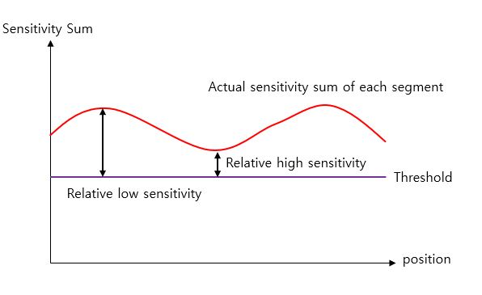

# IONIQ HEV/EV(AE PE/ AEEV PE)

## 1. Project Overview
- This project item is made of 2 parts: HVAC controller and 0D & 1D touch system
- I was in charge of the entire software development of the touch system and application

## 2. Development Environment
-  Software Platform developed internally(Non OS platform)
-  Compiler: Green Hills
-  V850 32-bit Microprocessor | ATtiny 1616 8-bit microprocessor 2ea
-  Git, Jira, Script Tool

## 3. Challenging issues / Research and Solution / Result
This section demonstrates what was challenging issues, how to research them, and how to solve them

---
### Challenge #1 - Ameliorating the non-linear sensitivity of slide touch sensors by devising software algorithms
When implementing a tap function by using slide touch sensors that are composed of interlaced patterned two nodes, irregular sensitivity was caused in the entire area of slide touch sensors, for the slide touch sensors were designed with a small size, erratic patterns in the connection, and the sensors were located under a concave cover panel. To ensure the constant sensitivity of slide touch sensors, I introduced a software algorithm, variable threshold using interpolation

### Research and Solution #1
**(Step 1)** Collected touch information such as positions, sensitivity values through SPI communication from touch
microprocessor
**(Step 2)** Made a two-dimensional lookup table with 30 elements that represents that X-axis presents a position value and
the Y-axis demonstrates a sensitivity value corresponding to the X-axis position value
**(Step 3)** Calculated a threshold value (80 % of max sensitivity value) corresponding to a new position value from the
lookup table by using a two-dimensional interpolation
**(Step 4)** Decided the slide touch’s on-off state from sensitivity values and the calculated threshold

 
<strong>Fig 1) the design pattern of slide(wheel touch sensors</strong>

 
<strong>Fig 2) Ideal sensitivity sum of each segment, when touching the slider touch sensor

**Fig.1)** shows the pattern of slide (wheel) touch sensor. When implementing 'Tap' gesture function by utilizing the slider touch sensor, the sensitivity sum of each sensor segment will be used to detect finger's touch state. In order to implement 'Tap' gesture function, the entire slider touch sensor should have a property of constant sensitivity regardless of the position of 'Tap' gesture on the slider touch sensor like **Fig.2)**. If the slider touch sensor does not show this property, a user definitely will feel the irregular sensitivity in the slider touch system.

 
<strong>Fig.3) Irregular sensitivity sum of each segment, when touching the slider touch sensor

However, as shown in **Fig 3)**, it is different in the real world. The reason is that the slide touch sensors were designed with a small size, erratic patterns between the connection, and the sensors were located under a concave cover panel.
